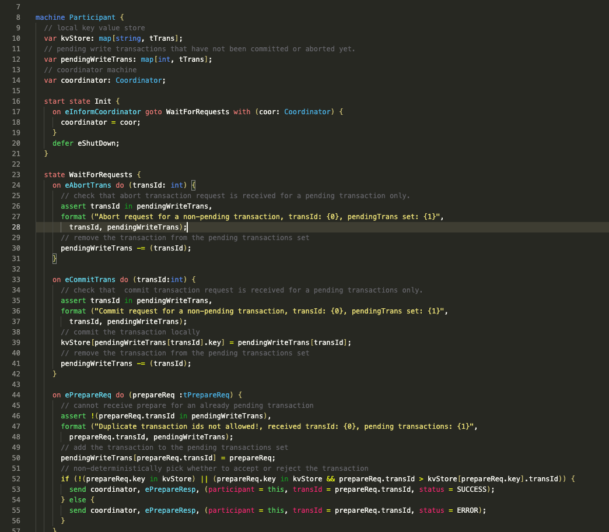
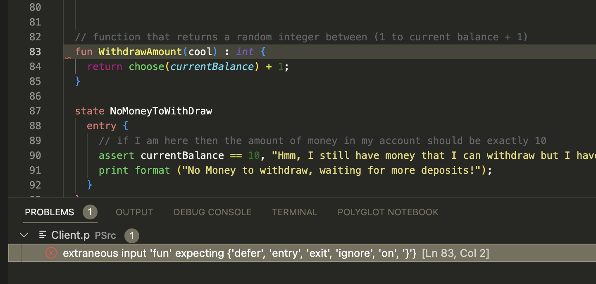
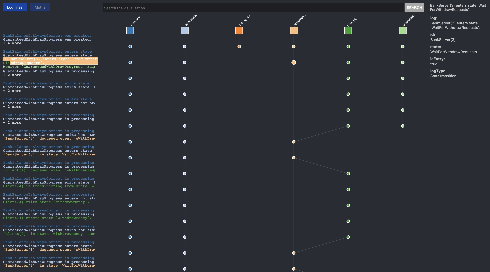

# Peasy: An Intuitive Development Environment for P

This is the VSCode extension for P. 

## Features

- **Compile and Run** `.p` files after pressing **f5** and saving files. If there are multiple P projects in the directory, users can toggle between projects by pressing **F4**.
- **Syntax highlighting** and a **Custom P theme**.
- **Snippets** to auto-complete P data structures and syntactical structures. 
- **Error Reporting** to detect errors after compilation.
- **Testing Framework** to test P files with `p check`
- **Iteration settings** for `p check` files. 
- **Error Tracing Visualization** to help debug errors in P project folders.

Below are [examples](#examples) of each feature. 

## Shortcuts

| Shortcut                  | Description                                                                             |
| :------------------------ | :-------------------------------------------------------------------------------------- |
|`F4`| Show dropdown menu, if there are multiple P projects in the Current Working Directory. |
| `F5`                      | Compile and run, if there is a P file in the directory.                                 |
| `F6`                      | Show P visualization of error tracing to help with debugging.                                                                                                         |

## Extension Settings

| Setting  | Description                                                                 | Default  |
| :-------------------------------- | :------------------------------------------------------------------------------------------------------------------------------------------------------------------------------------------------- | :------------------------------------------------------------- |
| `p-vscode.iterations` | Set to the number of iterations you want when `p check` is run inside of the IDE of a P testing folder.                                                                                                      | `1000`                                                         |
| `p-vscode.trace.server`     |  Set to 'verbose' to see the language server and client interactions in the Debug Console.                                                                                | `verbose`                                                     |

## Requirements
N/A

## **Examples**
Here are examples of each feature in the P extension!

### Compilation 

Press `F5` or `save` in order to compile the current P project. Use `f4` to toggle between the different P projects in a single directory. 

https://github.com/suesther/peasy-esther/assets/135176059/f615080d-3640-4960-9d36-5c919f50fbd3

### Syntax Highlighting and the P theme

### Snippets 

Different P data structures and syntax structures can be generated by typing in the beginning. Press `tab` to fill-in-the-blanks of these structures.

https://github.com/suesther/peasy-esther/assets/135176059/3f732295-cab3-4e17-a7ff-567a80a4a795

### Error Reporting

### Testing Framework

Run P checking tests and navigate to different Test Files through the VSCode `Testing` tab on the left.

https://github.com/suesther/peasy-esther/assets/135176059/229a906c-fd28-4627-be45-2fcb9384391e

### Iterations during  `p check`

When running automatic tests through P's Testing Framework, users can change the number of iterations run during the `p check` command by changing P extension configurations in .vscode/settings of your P project directory. 

https://github.com/suesther/peasy-esther/assets/135176059/dbfe9502-9617-4539-8123-0e709284e19e

### Error Tracing Visualization 

Press `F6` and choose JSON file prompted in the bottom right of VS Code in order to display a visualization that traces errors back to their source, enabling easier debugging.

#### Visualizer Breakdown
- Left panel: 
    - Log lines
    - Motif/pattern finding
- Center panel: 
    - Search bar for filtering
    - Machine and action/log visualizations
- Right panel: 
    - Details of an action/log

#### Features
##### Basics
**1**. Hovering over a log line highlights the corresponding node in the main panel and vice versa.

https://github.com/haoran-wen/peasy-ide-vscode/assets/137958518/92aeda6a-a14b-4c31-b492-d23649826006

**2**. A series of individual nodes are collapsible for compactness in UI.

https://github.com/haoran-wen/peasy-ide-vscode/assets/137958518/9baab3f1-97b0-4abf-b68c-f1667a9b59d6

**3**. Machines are toggleable so users can show/hide a machine.

https://github.com/haoran-wen/peasy-ide-vscode/assets/137958518/57bde9e0-a239-482c-be20-c40eb6f35368

**4**. Filtering a machine will remove all machines that has not direct connection to the current machine.  
In this example, we first filtered machine "Coordinator(6)", which hid all machines that has no direct connections to "Coordinator(6)". We then filtered machine "Client(9)" as well which removed all other machines as none of them were connected to both "Coordinator(6)" and "Client(9)".

https://github.com/haoran-wen/peasy-ide-vscode/assets/137958518/37b7958f-9006-4365-aabd-6f75af85da53

**5**. Clicking on an individual node will open a dialog box and it will have the log text by default and a "Show More" button if it has any fields. Clicking on the "Show More" will show details regarding the log.

https://github.com/haoran-wen/peasy-ide-vscode/assets/137958518/282ce375-caa8-4c3b-9212-e01fce2f6687

##### Motifs for pattern highlighting
**1**. Pre-built options  
Selecting one of the default motif options will highlights paths in the visualization that matches the motif pattren. In the example, paths in the main panel that matches Motif 1 (a simple sending request pattern, one machine sents to another machine) are highlighted.

https://github.com/haoran-wen/peasy-ide-vscode/assets/137958518/aa66741f-c956-451c-9774-953167571147

2. Building custom motifs  
You can build your own custom motif pattern in the search bar under the "Structured Search" tab. In the example, the custom motif searches for pattern where machine 1 sends something to machine 2, and then later sends something to machie 3, and lastly sends something to machine 4.
    1. Slingle click creates a node in a machine  
    2. Click and drag connects one machine's node to another machine's node  
    3. Double clicking a node deletes it  

https://github.com/haoran-wen/peasy-ide-vscode/assets/137958518/5a8e63a2-6e7d-409e-8476-8d1e0ec02f3a

##### Search bar
**1**. Fields filtering using "=". For example, typing `isEntry=true` in the search bar will look for logs that has a field of isEntry and its value is true. This supports multiple conditions. I.e. `action=DequeueEvent && state=WaitForPrepareResponses` will look for logs that are of action DequeueEvent and the machine is in state `WaitForPrepareResponses`

https://github.com/haoran-wen/peasy-ide-vscode/assets/137958518/6ca450db-4185-43e1-9d5d-ba02b42ff4f6

**2**. Text filtering. Filtering by text highlights a node if the log contains the text or the log's fields contains the text. I.e. typing `true` in search bar will look for logs that either contains the the word "true" or the log has fields that contain the word "true"

https://github.com/haoran-wen/peasy-ide-vscode/assets/137958518/b286f8ba-2d82-4377-85bc-54121f4ddd2d

**3**. Nonalphanumeric text filtering. If the text contains any nonalphanumeric characters, i.e. `"status=0"` ("=" being the nonalphnuermic character), surround the text with quotes. This example will look for logs that contains the text "status=0" or the log's fields contains the text "status=0"

https://github.com/haoran-wen/peasy-ide-vscode/assets/137958518/3432576d-5f3e-410b-b63a-1607c46876e9

## Known Issues
- Error Tracing Visualization is a Work in Progress.
- Pressing `F5` or saving consecutively too fast may cause an error message to appear in VSCode. Feel free to ignore this. 

## Install the Extension Locally
**NOTE**: Remove any previous versions of the extension from the extensions folder in .vscode. 
1. Clone this repository.
2. cd into the repository.
3. Run `vsce package -o ~ `. If the command errors, run `brew install vsce` and re-run the previous command.
4. The extension should now be in your user directory. Now, open a P code directory and navigate to the command pallete.
5. Search and click onto the command **Extensions: Install from VSIX...**
6. Install the VSIX file you just created.
You should get a notification saying `Completed installing P Extension extension from VSIX....`

**Reload VSCode, and your extension should now be working!**
**Enjoy!**

